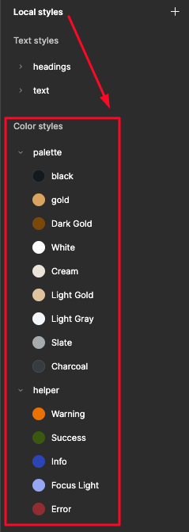
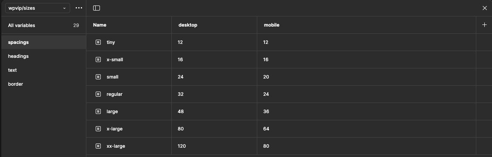
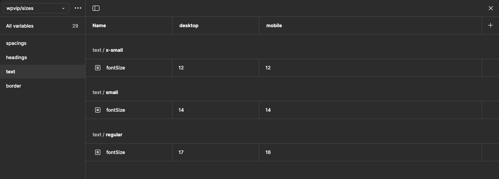
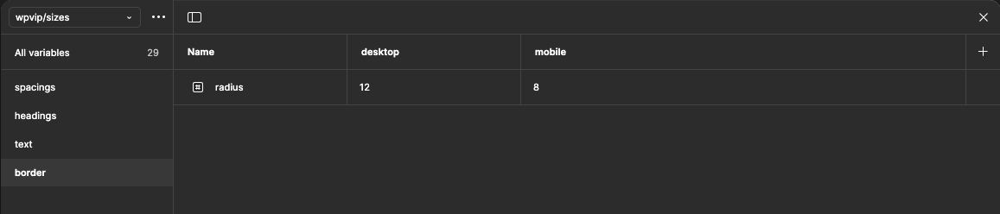
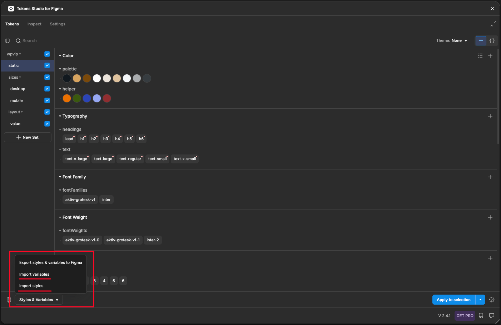
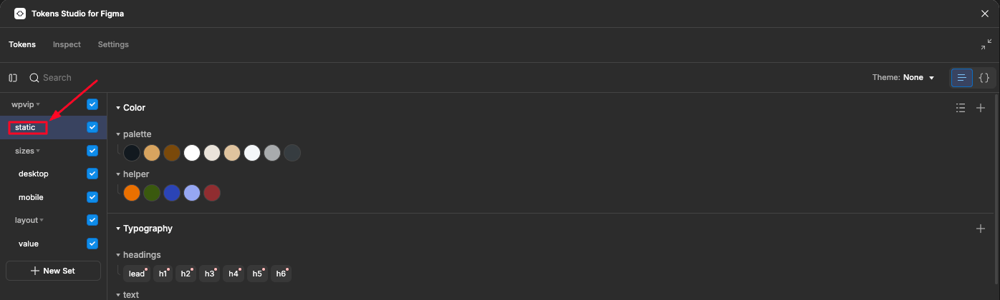
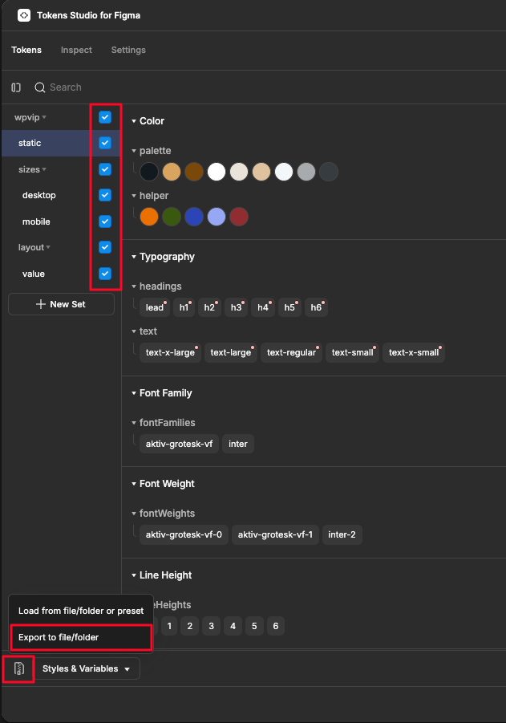
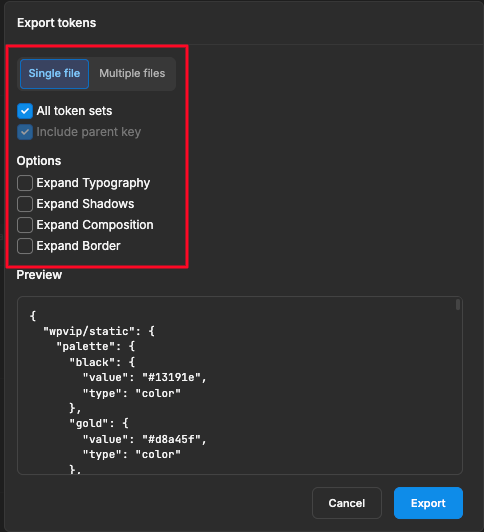
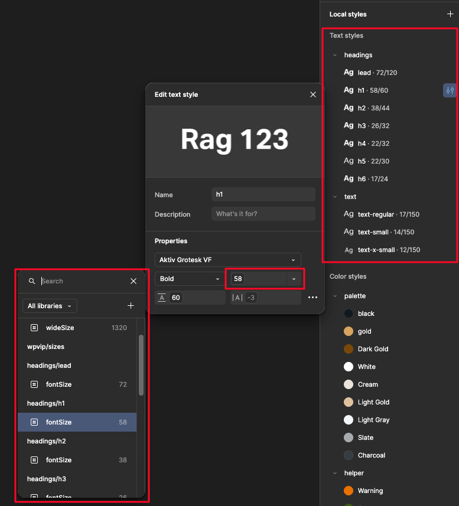

# WPVIP Theme JSON Generator

This guide describes how to effectively manage the Theme JSON generation process for your WordPress theme using tokens exported from Figma using free "Tokens Studio for Figma" plugin.

---

## - Folder Structure

All Theme JSON-related files must reside in the following directory within your theme root:

```
your-theme/
├── package.json                   # Default package.json
└── wpvip-theme-json/
    ├── static-theme.json          # Edit it as regular theme.json
    ├── dynamic-theme.json         # Auto-generated (DO NOT EDIT)
    ├── theme.json                 # Final merged JSON for WP theme
    ├── theme-json-generator.js    # Script to generate dynamic-theme.json
    ├── merge-theme-json.js        # Script to merge static and dynamic JSON
    ├── tokens.json                # Tokens exported from Figma
    ├── utils.js                   # Utility functions (clamp calculations)
    └── img/
        └── images.png             # Just for demo purpose
```

---

## - NPM Scripts (`package.json`)

Include these scripts in your `package.json` for easy automation:

```json
"scripts": {
  "generate-dynamic-json": "node wpvip-theme-json/theme-json-generator.js",
  "merge-theme-json": "node wpvip-theme-json/merge-theme-json.js",
  "generate-theme-json": "npm run generate-dynamic-json && npm run merge-theme-json"
}
```

**To generate your final `theme.json`, run:**

```bash
npm run generate-theme-json
```

---

## - Important Notes

### Dynamic JSON
- **Never manually edit `dynamic-theme.json`**. It is auto-generated from your `tokens.json`, and any manual changes will be overwritten upon regeneration.

### Static JSON
- **Always make manual changes in `static-theme.json`**. This ensures your settings remain safe and integrated properly into your final Theme JSON.

---

## - Token Structure & Parsing

Your `tokens.json` ( exported from Figma using free version of "Token Studio for Figma" plugin ) should adhere to the following structure for proper parsing:

### Colors
```
wpvip/static.palette
wpvip/static.helper
```


### Spacings
```
wpvip/sizes/desktop.spacings
wpvip/sizes/mobile.spacings
```
- Keys must match exactly between desktop and mobile.
- Clamp values generated using `clampRem` in `utils.js`.



### Headings (`h1`–`h6`)
```
wpvip/sizes/desktop.headings
wpvip/sizes/mobile.headings
```
- Keys must match exactly between desktop and mobile.
- Clamp values (`fontSize`, `lineHeight`, `letterSpacing`) auto-generated.


### Text Styles
```
wpvip/sizes/desktop.text
wpvip/sizes/mobile.text
```
- Keys must match exactly between desktop and mobile.
- Clamp values (`fontSize`) auto-generated.



### Custom CSS Variables

Clamp values are auto-generated for:
- All headings (excluding `h1`–`h6`, e.g., `lead`) from:
```
wpvip/sizes/desktop.headings
wpvip/sizes/mobile.headings
```
- Border radius from:
```
wpvip/sizes/desktop.border.radius
wpvip/sizes/mobile.border.radius
```


---

## - Export (`tokens.json`) from Token Studio

1. Import variables into Token Studio from Figma <br>
<br><br>
2. Make sure that `styles` are renamed to `static` and placed under `wpvip` in tokens hierarchy. <br>
 <br><br>
3. Mark all tokens with checkboxes and press export button <br>
<br><br>
4. Export tokens using recommended settings. <br>
<br><br>
5. Rename exported `.json` file into `tokens.json` and place it to `your-theme/wpvip-theme-json/` folder <br><br>
6. **Note:** CSS variables are only generated for dynamic variables defined explicitly in Figma. If you wish to use CSS variables, ensure your text styles in Figma are linked to these dynamic tokens. Static text or headings (not linked to dynamic tokens) will not have CSS variables automatically created.<br>


___

## - Clamp Generation (`utils.js`)

Responsive clamp values for CSS are calculated using the `clampRem` function inside `utils.js`:

```javascript
setClampSize(desktopValue, mobileValue);
```

This function manages responsive values such as:
- Font Size
- Spacing
- Line Height
- Letter Spacing
- Border Radius

Adjust viewport ranges (`viewportMinPx` and `viewportMaxPx`) directly within `utils.js` if needed or pass them as 3rd and 4th parameters for `setClampSize()` function.

---

## - Merging Static & Dynamic JSON

Running the following command:

```bash
npm run generate-theme-json
```

will:

1. Generate `dynamic-theme.json` from `tokens.json`.
2. Merge `static-theme.json` and `dynamic-theme.json` into the final `theme.json`.

Your final `theme.json` will include:
- Editable static settings
- Dynamically generated settings from your Figma Tokens

After a new `theme.json` is generated, validate it and replace the main `theme.json` with generated one

---

## - Recommended Workflow

- Edit manually only in `static-theme.json`.
- **Never** edit `dynamic-theme.json`.
- Modify `theme-json-generator.js` if you want to generate new colors / sizes from Figma.
- After updating tokens from Figma, regenerate your theme:

```bash
npm run generate-theme-json
```

---

🎉 **You're all set!**

For any additional questions or assistance, reach out to your development team.
